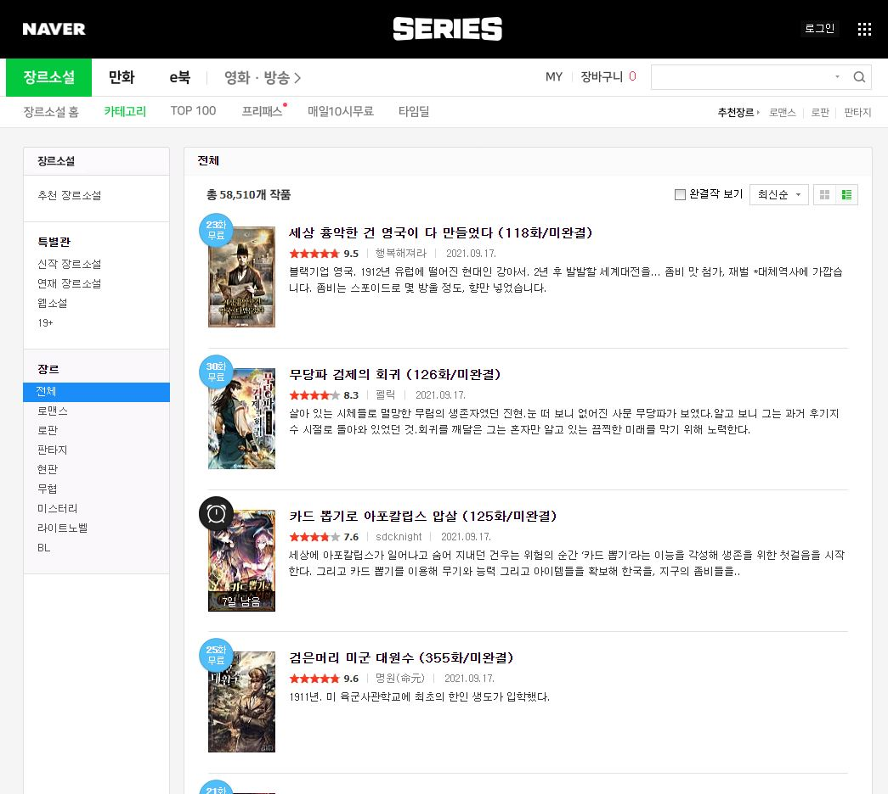
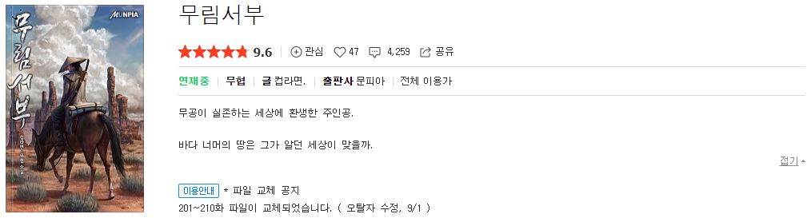
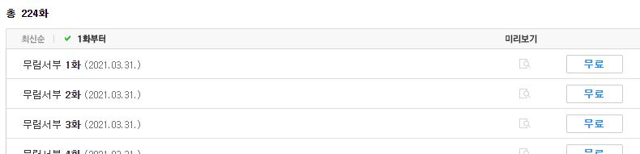
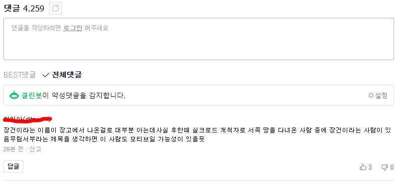
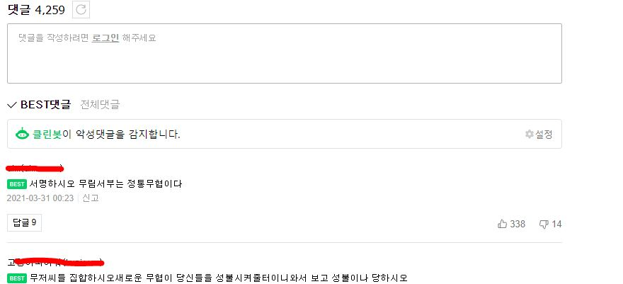

# 네이버 시리즈 웹소설?
나는 평소 웹툰을 많이 본다. 요즘 웹소설로 그린 웹툰이 많아지면서, 웹소설도 많은 독자가 있다는 걸 알게 되었다.
  
내가 무려 중학생때 자주 읽었던 판타지, 무협 같은 장르의 많은 소설들이 지금까지 쭈욱 연재되어 온거 같다. 또한 알게 모르게 웹 소설을 원작으로한 드라마도 있었다.
  

 
나무위키를 보아하니 위의 네이버 시리즈, 카카오 페이지, 문피아라는 3가지 플랫폼이 가장 큰거 같았다. 그 중 네이버 시리즈의 데이터를 수집하여 데이터 분석을 진행한다.

# 어떤 데이터를 수집할 것인가?
네이버 시리즈의 웹소설 페이지에 나오는 정보를 수집할 것이다. 웹소설 목록 페이지와, 목록 페이지의 소설을 클릭했을 때 접속되는 소설 페이지의 정보를 크롤링할 예정이다.
  
구체적으로 내게 필요한 정보를 선정하진 않았고, 크롤링한 사이트에 나오는 정보 중 분석결과에 영향을 줄만한 것은 모조리 수집할 계획이다.

# 웹소설 목록 페이지

 
웹소설 카테고리 탭의 전체목록을 누르면 모든 소설이 최신 업데이트 순으로 나열된다.
 
위 페이지에서 수집할 수 있는 정보는 다음과 같다.
- 제목
- 총 에피소드 개수
- 완결여부
- 평점
- 작가
- 최신 업데이트 날짜
- 소개글

# 웹소설 페이지
목록에서 특정 소설을 클릭하면 해당 웹 소설에 대한 페이지로 접속된다. 이 페이지에서 수집할 수 있는 정보는 크게 소설 정보, 회차 정보, 댓글 3가지가 있다.
## 1. 소설 개요

 
제일 먼저 보이는 소설 개요 부분이다. 목록에서 얻을 수 있는 정보를 제외하면, 다음과 같다.
- 좋아요
- 총 댓글 수
- 연재상태
- 장르
- 출판사
- 연령
- 2차 창작물
- 더 긴 소개글

## 2. 회차 정보

 
그 다음 보여지는 정보로는 회차 정보가 있다. 여기서는 앞에서 수집한 정보를 제외하면 다음과 같다.
- 연재 시작일
- 최신 에피소드 차수

## 3. 댓글

댓글에서 얻을 수 있는 정보는 총 댓글 수, 댓글, 베스트 댓글, 댓글의 좋아요, 싫어요, 댓글을 등록한 날짜 등이 있다.

# 정리
위에서 수집할 데이터를 정리해 보면 다음과 같은 정보를 수집할 수 있다.
- 제목
- 총 에피소드 개수
- 완결여부
- 평점
- 작가
- 최신 업데이트 날짜
- 소개글
- 좋아요
- 총 댓글 수
- 연재상태
- 장르
- 출판사
- 연령
- 2차 창작물
- 연재 시작일
- 최신 에피소드 차수
- 댓글
- 베스트 댓글
- 댓글 좋아요
- 댓글 싫어요
- 댓글 등록일

# 마치며
목록과 소설 페이지를 합치면 총 60000개가 넘는 페이지를 접속해 데이터를 가져오게 된다. 또한 글 작성일 기준 58510개의 작품의 데이터를 얻을 수 있을 것 같다.
  
위에서 수집한 자료만으로 충분한 데이터 분석을 할 수 있을지는 잘 모르겠다. 연령별, 성별, 조회수 데이터가 없는게 조금 아쉽지만, 추후 필요하다고 판단되면 카카오페이지나 문피아에서도 데이터를 수집하면 될 것 같다.